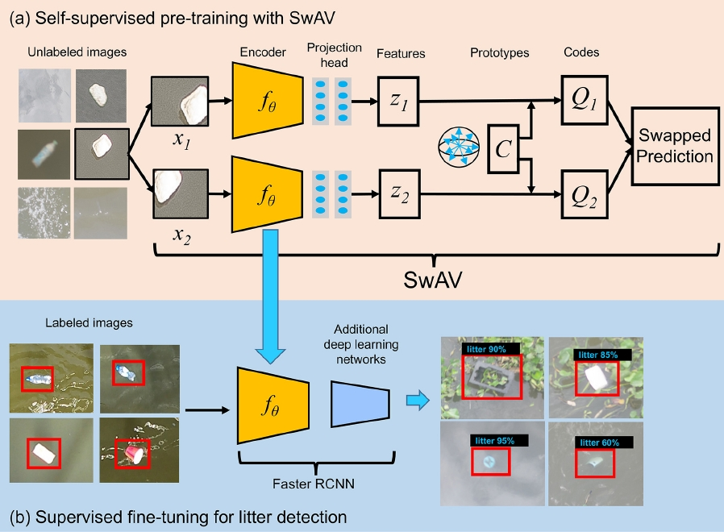
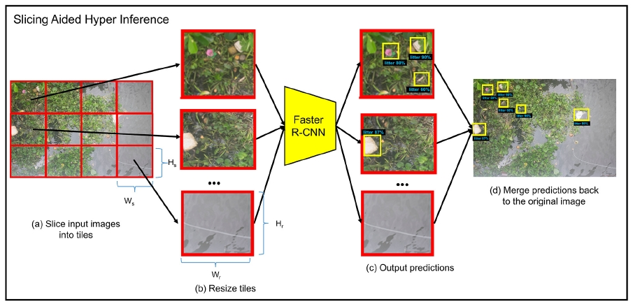

# Detection of floating litter with semi-supervised learning and SAHI method

This repository contains the code used for the following [publication](https://doi.org/10.1016/j.watres.2025.124833):
```bash
Jia, T., Taormina, R., de Vries, R., Kapelan, Z., van Emmerik, T. H., Vriend, P., & Okkerman, I. (2025). A semi-supervised learning-based framework for quantifying litter fluxes in river systems. Water Research, 124833.
```

The aim of this study is to propose a semi-supervised learning (SSL)-based framework for quantifying floating litter fluxes in rivers. This repository contains the code for developing the SSL model and performing inference using the Slicing Aided Hyper Inference (SAHI) method. More details of these methods can be found in these repositories: (1) [SSL](https://github.com/TianlongJia/deep_plastic_SSL), and (2) [SAHI](https://github.com/obss/sahi). For comparison, we also evaluate the same Faster R-CNN architecture trained solely with supervised learning (SL) and initialized with ImageNet pre-trained weights. 



Figure 1. The schematic diagram of the two-stage semi-supervised learning method.



Figure 2. The schematic illustration of SAHI for detecting floating litter.

Acknowledgement:

This project was inspired by the work of Facebook AI Research and the [Vissl v0.1.6](https://github.com/facebookresearch/vissl) library. 
Learn more about VISSL at [documentation](https://vissl.readthedocs.io). And see the [projects/](projects/) for some projects built on top of VISSL.

## Installation

See [`INSTALL.md`](./INSTALL.md).

## Usage

-  Step 1: Pre-train models using a self-supervised learning method, i.e., SwAV, (see `main_Self_Supervised_Train_.ipynb`).
-  Step 2: Fine-tune the models obtained from Step 1 using in a supervised learning method for object detection (see `main_Fine_tune_for_object_detction.ipynb`).
-  Step 3: Evaluate model performnaces on test sets for object detection, e.g., AP50, and predicting images (see `main_Evaluate_Object_Detection.ipynb`).
-  Step 4：Evaluate model performnaces on test sets for object detection using SAHI (see `main_Evaluate_Object_Detection_with_SAHI.ipynb`).
-  Step 5: Output confusion matrix on test sets for object detection, e.g., TP, FP, and FN (see `main_Confusion_matrix_OD.ipynb`).

## Model weights

The trained model weight files from this pubilication can be found [here](https://doi.org/10.5281/zenodo.18141160).
。
## Citing this project or paper

If you find this project is useful in your research or wish to refer to the paper, please use the following BibTeX entry.

```BibTeX
@article{jia2025semi,
  title={A semi-supervised learning-based framework for quantifying litter fluxes in river systems},
  author={Jia, Tianlong and Taormina, Riccardo and de Vries, Rinze and Kapelan, Zoran and van Emmerik, Tim HM and Vriend, Paul and Okkerman, Imke},
  journal={Water Research},
  pages={124833},
  year={2025},
  publisher={Elsevier}
}
```

## Contact

➡️ Tianlong Jia ([tianlong.jia@kit.edu](mailto:tianlong.jia@kit.edu))
